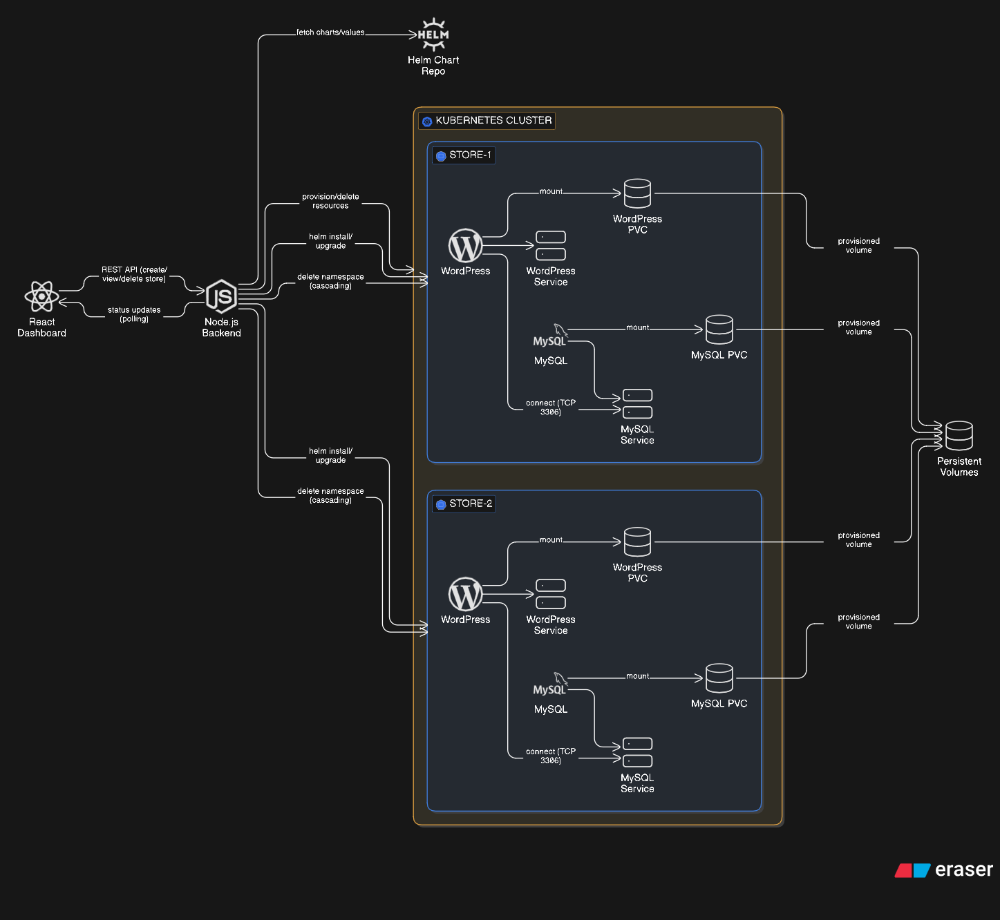

# Store Provisioning Platform

A kubernetes-native platform for provisioning isolated WooCommerce stores with one-click deployment.



## Features

- One-click store creation via React dashboard
- Complete namespace isolation per store
- Helm-based deployments (local -> production)
- Automatic MySQL readiness checks
- Clean resource teardown
- Persistent storage for databases
- Production-ready with k3s deployment

## Technology Stack

- **Frontend**: REACT 18
- **Backend**: Node.js + Express
- **Orchestration**: Kubernetes + Helm 3
- **Containerization**: Docker
- **Database**: MySQL 8.0
- **CMS**: WordPress + WooCommerce
- **Production k8s**: k3s

## Quick Start

### Prerequisites

- Docker Desktop with Kubernetes enabled
- Node.js 18+
- kubectl
- Helm 3.x

### Local Setup 

**1. Clone the repository**
```bash
git clone https://github.com/akanksha-th/store-provisioning-platform.git
cd store-provisioning-system
```

**2. Install dependencies**
```bash
# Backend
cd backend 
npm install

# Dashboard
cd ../dashboard
npm install
```

**3. Start Kubernetes**
- Open Docker Desktop
- Go to Settings -> Kubernetes -> Enable Kubernetes
- Wait for kubernetes to start

**4. Start the platform**
```bash
# Terminal-1 - Backend
cd backend
node server.js

# Terminal-2 - Dashboard
cd dashboard
npm start
```

**5. Open Dashboard**
```
http://localhost:3000
```

**6. Create your first store:**
- Click "Create New Store"
- Wait 2-3 minutes for provisioning
- Click "Open Store" when status shows "Ready"

## Production Deployment

### VPS Setup

**1. Launch Ubuntu 22.04 VM (AWS)**

**2. Install k3s**
```bash
curl -sfL https://get.k3s.io | sh -s - --write-kubeconfig-mode 644

# Wait 30 seconds for k3s to start
sleep 30

# Verify installation
kubectl get nodes
```

**3. Get k3s config**
```bash
sudo cat /etc/rancher/k3s/k3s.yaml
```

**4. Configure kubectl on laptop**
```bash
# Copy k3s config to ~/.kube/config-prod
# Update server IP: https://YOUR_VM_IP:6443
export KUBECONFIG=~/.kube/config-prod
kubectl get nodes
```

**5. Deploy a store**
```bash
helm upgrade --install store-prod store-chart \
  --set storeId=store-prod \
  --values store-chart/values-prod.yaml \
  --namespace store-prod \
  --create-namespace \
  --wait \
  --timeout 5m
```

**6. Get NodePort**
```bash
kubectl get service wordpress-service -n store-prod
```

**7. Access store**
```
http://YOUR_VM_IP:NODE_PORT
```

## End-to-End Testing

### Place an Order (WooCommerce)

**1. Complete WordPress Setup:**
- Access: `http://localhost:NODE_PORT`
- Language: English
- Site Title: "My Store"
- Username/Password: your choice
- Email: your email

**2. Install WooCommerce:**
- WordPress Dashboard → Plugins → Add New
- Search "WooCommerce" → Install → Activate
- Skip setup wizard (click "Skip this step")

**3. Add a Product:**
- WooCommerce → Products → Add New
- Name: "Test Product"
- Regular Price: $10
- Publish

**4. Place an Order:**
- Visit storefront (click "Visit Store")
- Add product to cart
- Proceed to Checkout
- Fill billing details (any test data)
- Payment: Cash on Delivery
- Place Order

**5. Verify Order:**
- WordPress Dashboard → WooCommerce → Orders
- Should see your order!

## Helm Chart Details

### Templates

**namespace.yaml**: Creates isolated namespace per store
**mysql-deployment.yaml**: Statefulset like deployment with:
- Liveliness/readiness probes
- Resource limits (256Mi-512Mi RAM, 250m-500m CPU)
- Persistent volume mount

**wordpress-deployment.yaml**:
- initContainer waits for MySQL readiness
- Liveliness probe: `/wp-login.php`
- Readiness probe: `/wp-login.php`
- Connects to `mysql-service` via DNS

**Services**: ClusterIP for MySQL, NodePort for WordPress

### Values Hierarchy
```
values.yaml (base)
values-local.yaml (overrides for local)
values-prod.yaml (overrides for production)
```

## Troubleshooting

### Store stuck in "Provisioning"

**Check pod status:**
```bash
kubectl get pods -n STORE_ID
```

**Check logs:**
```bash
kubectl logs -n STORE_ID deployment/wordpress
kubectl logs -n STORE_ID deployment/mysql
```

### Can't access WordPress

**Verify service:**
```bash
kubectl get service wordpress-service -n STORE_ID
```

**Check NodePort is accessible:**
```bash
curl http://localhost:NODE_PORT
```

### Delete not working

**Manual cleanup:**
```bash
helm uninstall STORE_ID -n STORE_ID
kubectl delete namespace STORE_ID
```

## Known Limitations

- No TLS/HTTPS
- No custom domain (requires Ingress Controller)
- No RBAC (all operations use admin context)
- No NetworkPolicies (pods can talk to each other)
- WooCommerce requires manual setup
- Single node deployment

## Performance Tuning

**Resource Allocation:**
```yaml
MySQL:
  requests: 256Mi RAM, 250m CPU
  limits: 512Mi RAM, 500m CPU

WordPress:
  requests: 256Mi RAM, 250m CPU
  limits: 512Mi RAM, 500m CPU
```

**Storage:**
- MySQL PVC: 5Gi (adjustable in values)
- Local path provisioner (k3s default)

**Concurrent Provisioning:**
- Backend handles async provisioning
- No queue/worker pattern (single-node OK)

## Author

Akanksha
- GitHub: akanksha-th

## Acknowledgments

- Assignment from Urumi AI SDE Internship Round 1
- Built as learning project for Kubernetes + Helm